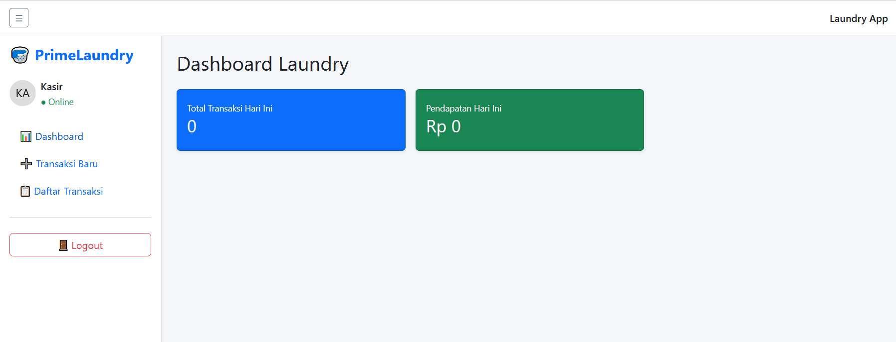
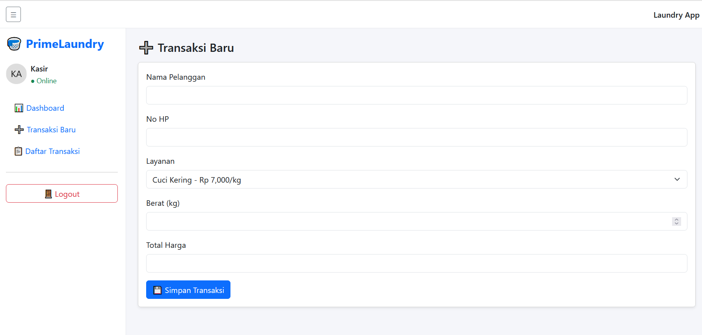
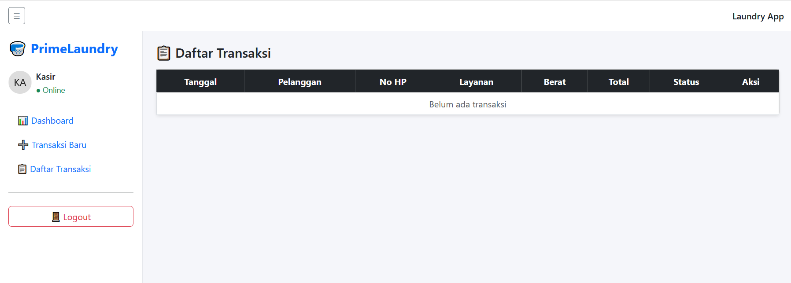

# Aplikasi Laundry Laravel

Aplikasi manajemen laundry berbasis web untuk mengelola transaksi, kasir, dan laporan.  
Dibangun menggunakan framework **Laravel**.

## ✨ Fitur Utama

-   Manajemen transaksi laundry
-   Sistem kasir
-   Laporan transaksi
-   Autentikasi pengguna
-   Tampilan berbasis Blade Template

## 🛠️ Teknologi yang Digunakan

-   Laravel
-   PHP
-   Blade Template
-   MySQL
-   Vite

## 📸 Screenshot Aplikasi

### Dashboard

Menampilkan ringkasan transaksi dan pendapatan harian.


### Halaman Kasir

Form input transaksi laundry untuk kasir.


### Halaman List Transaksi

Daftar seluruh transaksi yang sudah tercatat.


## ⚙️ Cara Menjalankan Project

1. Clone repository
    ```bash
    git clone https://github.com/Doramidesu/aplikasi-laundry-laravel.git
    ```
2. Persiapan
   Pastikan **PHP**, **Composer**, dan **Node.js** sudah terinstall.

3. Install dependency

    ```bash
    composer install
    npm install
    ```

4. Konfigurasi environment

    ```bash
    cp .env.example .env
    php artisan key:generate
    ```

5. Migrasi database

    ```bash
    php artisan migrate
    ```

6. Membuat Akun Login

    ```bash
    php artisan tinker
    ```

7. Lalu masukkan kode berikut:

    ```php
    use App\Models\User;

    User::create([
    'name' => 'Kasir',
    'email' => 'kasir@laundry.com',
    'password' => bcrypt('kasir123')
    ]);
    ```

8. Keluar dari Tinker:

    ```bash
    exit
    ```

9. Menambahkan data jenis layanan:

    ```bash
    php artisan db:seed --class=ServiceSeeder
    ```

10. Menjalankan Aplikasi
    ```bash
    php artisan serve
    ```
